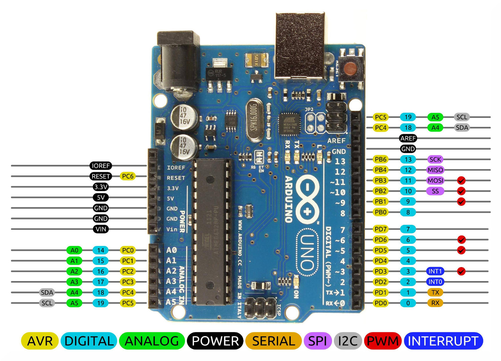

# 설명

* Adafruit tmp117(temperature) sensor is connected to Arduino Uno (R3)
* Arduino Uno is connected to Raspi via USB cable
* Arduino IDE is installed in Raspi
* python file is created in Raspi to receive data from Arduino


# Presettings

### Arduino IDE 설치 in Raspi

* check raspi bit
```
$ getconfig LONG_BIT        # 32Bit
```
* <a href="https://www.raspberrypi-spy.co.uk/2020/12/install-arduino-ide-on-raspberry-pi/">install Arduino 절차</a>


### Arduino를 raspi와 Hw 연결

* arduino완 raspi를 USB(blue) 케이블로 연결

 <br>

*(이렇게 하면 아두이노 power on 기능도 함)*

* ```$lsusb``` 하면  'Arduino SA UNO R3(CDC ACM)'과 같은 아두이노 인식됐다는 내용을 볼 수 있음


### Arduino가 연결된 serial 포트 확인
* Arduino IDE 앱에서 
    - tool - 보드: Arduino Uno를 선택
    - tool - 포트: **/dev/ttyACM0**(Arduino Uno) 와 같은 새로운 포트가 생김. **이는 아두이노를 라베파에 연결했기 때문에 그거에 대한 포트임**. 그걸 선택.
*(Serial.print할때 그포트인 /dev/ttyACM0에 데이터가 써지게 됨(??))*


### Arduino에 temp sensor 연결
Arduino pinout이 다음과 같기 때문에: 



<br>
tmp117 센서를 해당한 핀에 다음과 같이 연결함:


### Arduino에 temp sensor 소스 준비 및 실행
 <a href="https://learn.adafruit.com/adafruit-tmp117-high-accuracy-i2c-temperature-monitor/arduino">이 link와</a> 똑같이 함:

* Arduino IDE 열고
* Sketch - Manage Libraries에서 
    1. adafruit_tmp117
    2. adafruit_busio
    3. adafruit Unified sensor library들을 설치함.

* Sample 예제 실행:
    - File-Examples-Adafruit TMP117-basic_test 선택한 후
    
    

    

    클릭하여 실행한 후

<br><br>

    tool-Serial Monitor 클릭하면 Serial.print 내용들이 출력됨.
    


### Raspi에 python file 생성 및 소스 작성

