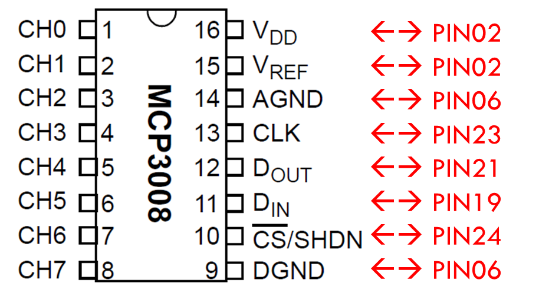
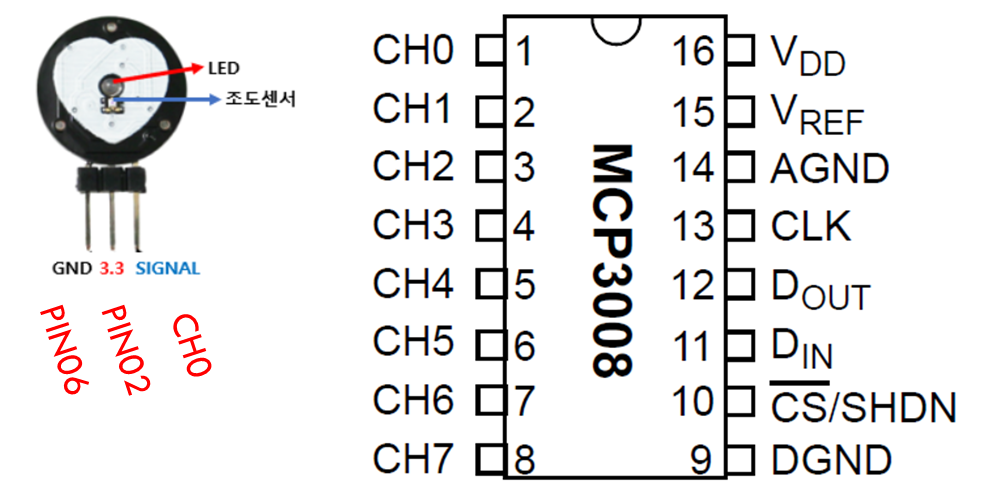
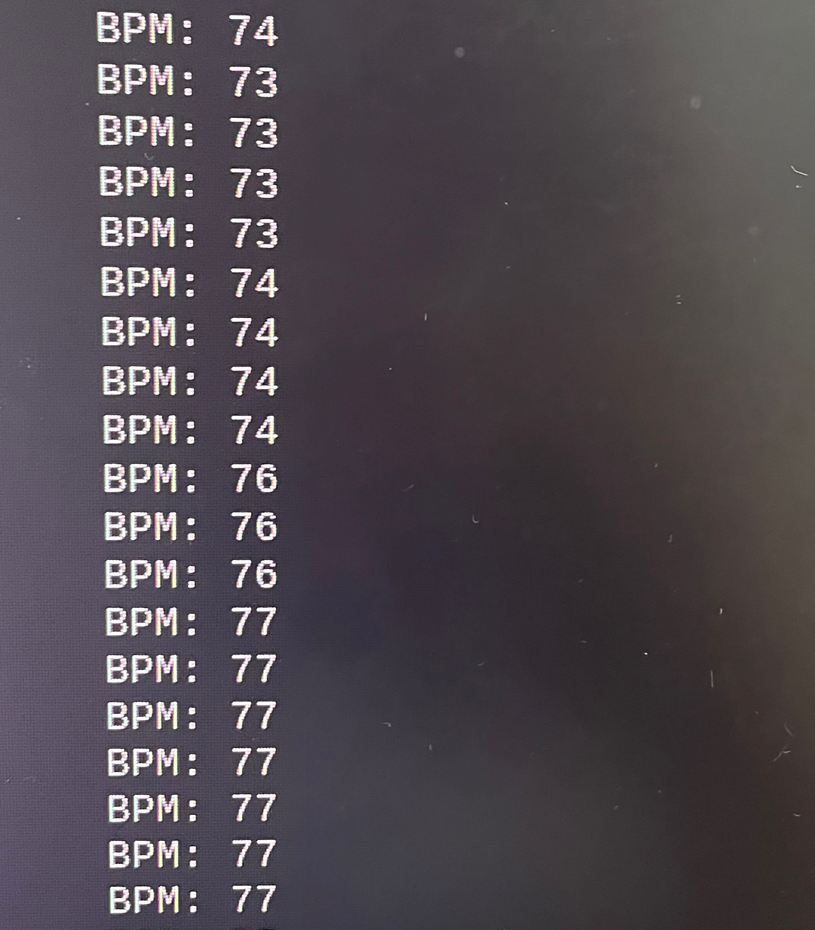

### hw chip 목록
- Raspberry pi 4B
- pulse sensor
- ADC converter: MCP3008

Pulse sensor 값은 analog임. arduino는 analog 핀들도 있지만 
라베파는 아날로그 핀이 없음. 
그래서 ADC converter chip을 사용하여 pulse의 아날로그 데이터를 
디지털로 변환후 라베파로 전송하기 위해 adc converter를 사용했음. 
 
 

### Raspi Presettings

*(SPI가 꼭 enable 되어 있어야함)*

### chip들을 Raspi와 GPIO 연결

Raspberry Pi pinout이 다음과 같이 때문에:
 

  

**ADC converter**를 다음과 같이 연결하고:
 

  

**Pulse sensor**를 다음과 같이 연결한다:
 

**Note!** Pulse sensor의 signal pin은 adc converter의 channel pin에 연결하고, 나머지 gnd와 3.3v는 전원공급을 위해 raspberry pi 핀에 연결하고 있다.

  

### 실행 결과

