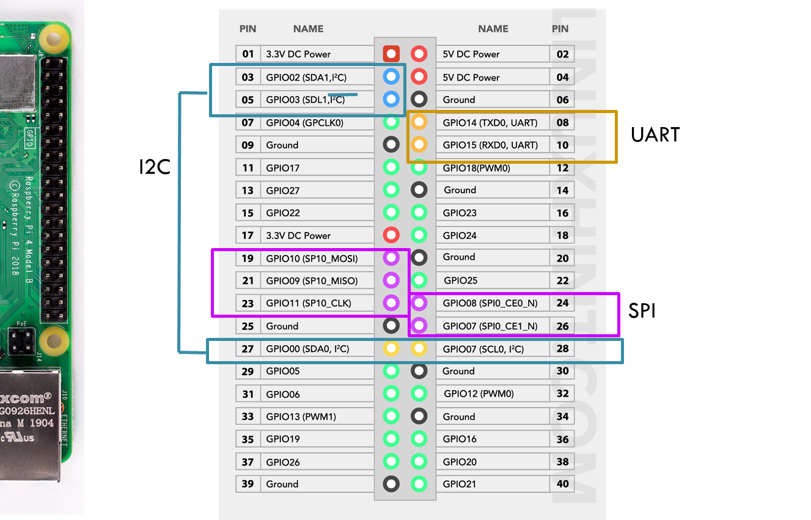

### hw chip 목록
- Raspberry pi 4B
- pulse sensor
- ADC converter: MCP3008

Pulse sensor 값은 analog임. arduino는 analog 핀들도 있지만<br>
라베파는 아날로그 핀이 없음.<br>
그래서 pulse의 아날로그 데이터를 디지털로 변환후<br>
라베파로 전송하기 위해 adc converter를 사용했음.<br>
<br>
<br>


### Raspi Presettings


*(SPI가 꼭 enable 되어 있어야함)*

<br>
<br>


### chip들을 Raspi와 GPIO 연결

Raspberry Pi pinout이 다음과 같이 때문에:
<br>



<br><br>

**ADC converter**를 다음과 같이 연결하고:
<br>


<br><br>

**Pulse sensor**를 다음과 같이 연결한다:
<br>


**Note!** Pulse sensor의 signal pin은 adc converter의 channel pin에 연결하고, 나머지 gnd와 3.3v는 전원공급을 위해 raspberry pi 핀에 연결하고 있다.


**핀 연결 정리:**
```
		Pulse_sen		MCP3008		  	RaspPi
					Pin 16(VDD)	  --	Pin 1(3.3V)
					Pin 15(VREF)	  -- 	Pin 1(3.3V)
					Pin 14(AGND)	  -- 	Pin 6(GND)
					Pin 13(CLK)	  --	Pin 23(SCLK)
					Pin 12(DOUT)	  --	Pin 21(MISO)
					Pin 11(DIN)	  --	Pin 19(MOSI)
					Pin 10(SC/SHDN)	  --	Pin 24(CE0)
					Pin 9(DGND)	  --	Pin 6(GND)
		
		Data		-----  Pin 1(CH0)				
		Vcc		--------------------------	Pin 1(3.3V)		
		Gnd		--------------------------	Pin 6(GND)
```

<br><br>


### 소스 코드 및 실행
<a href="https://tutorials-raspberrypi.com/raspberry-pi-heartbeat-pulse-measuring/">이 link</a>와 똑같이 하면 됨:
<br>

* git clone
  ```
  $ git clone https://github.com/tutRPi/Raspberry-Pi-Heartbeat-Pulse-Sensor
  ```
* 실행 (zrn:새로운 venv를 생성해서 거기서 하는 걸 추천추천)
  ```
  $ cd Raspberry-Pi-Heartbeat-Pulse-Sensor/
  $ sudo python example.py
  ```

### 실행 결과


